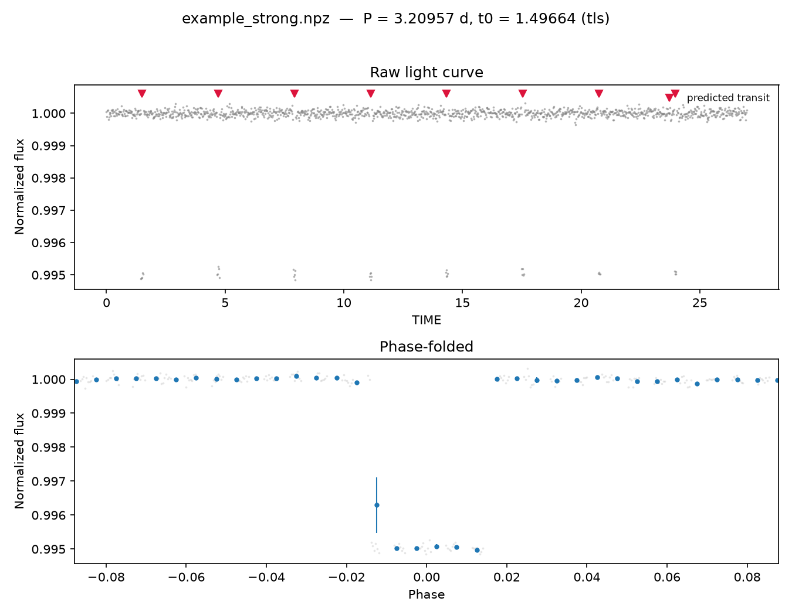
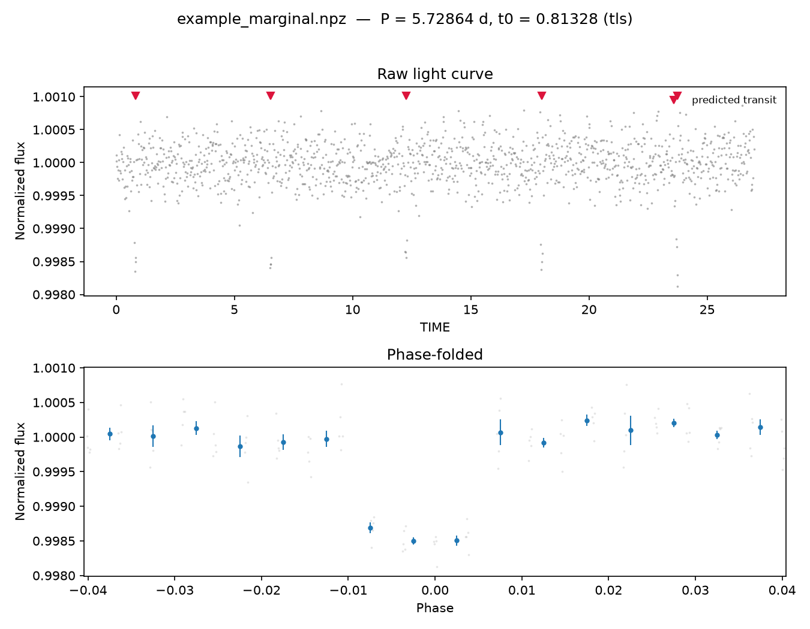
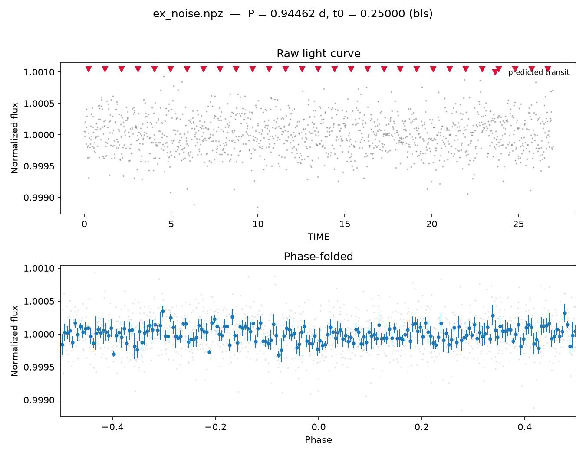
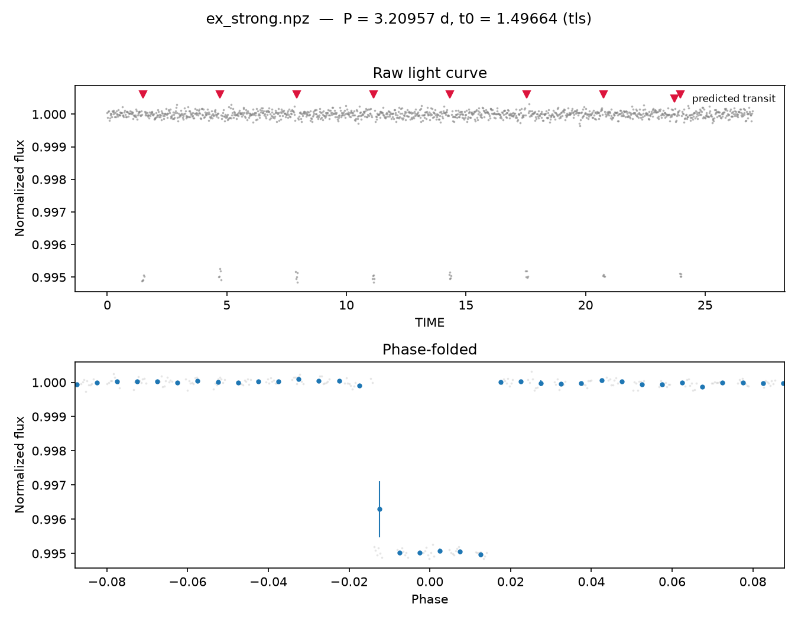
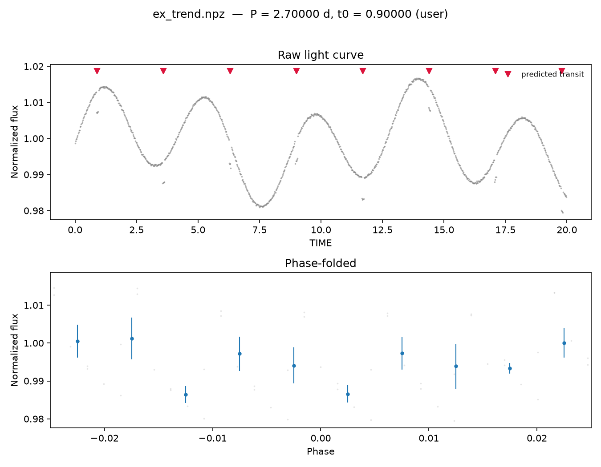
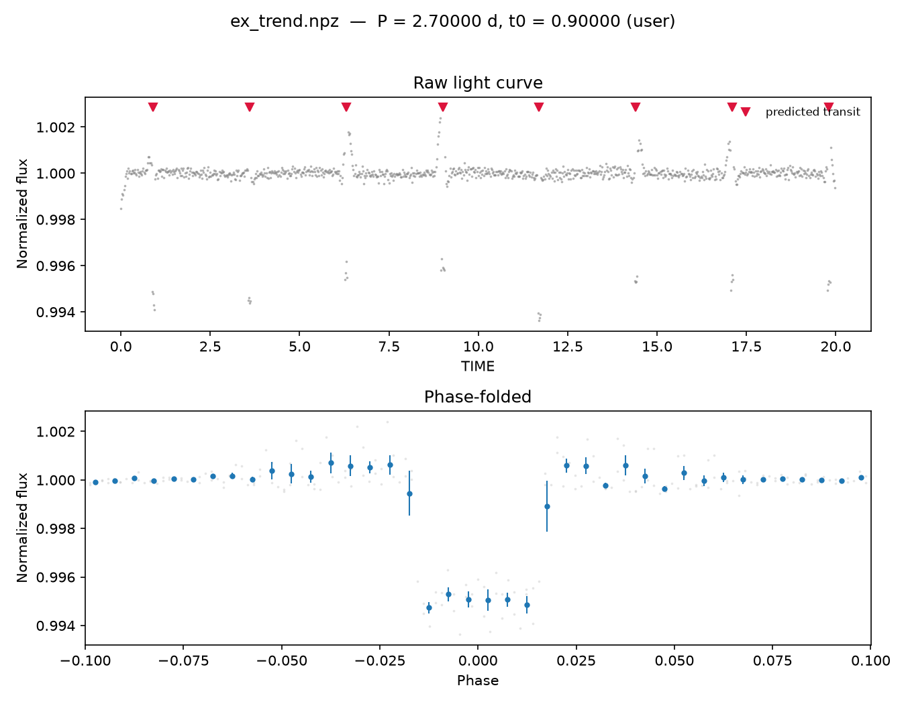
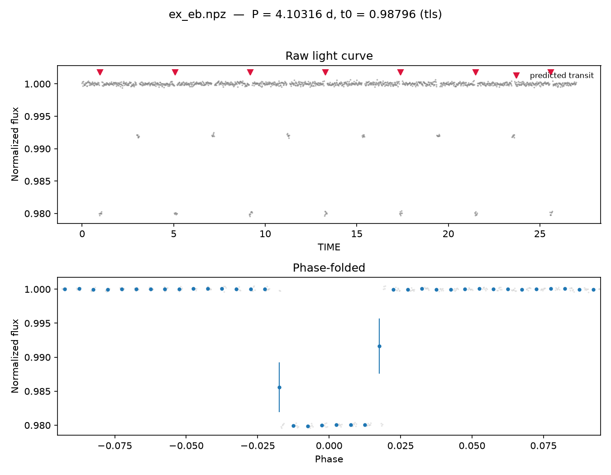

# foldr

Phase-folding and period-search CLI for astronomical light curves. Point it
at a `.fits`, `.npz`, `.csv`, or `.txt`/`.dat` file and it finds the best
period (via [Box Least Squares](https://docs.astropy.org/en/stable/timeseries/bls.html)
or, optionally, [Transit Least Squares](https://github.com/hippke/tls)),
phase-folds and bins the data, prints the key transit numbers, and saves a
diagnostic plot (three panels when a period search ran — raw light curve,
phase-folded curve, and the periodogram; two panels when you supply
`--period` directly, since there's no search to plot).



## Install

```bash
pip install git+https://github.com/nikhilcherry/foldr
```

BLS (via astropy) is included in the base install and requires no extra
setup. TLS is optional and pulled in with an extra:

```bash
pip install "foldr[tls] @ git+https://github.com/nikhilcherry/foldr"
```

If TLS isn't installed and you ask for it explicitly (`--engine tls`), foldr
exits with a clear message telling you to install the extra rather than
crashing with an import traceback. In `--engine auto` (the default), foldr
silently falls back to BLS whenever TLS isn't importable.

## Usage

Search for a period and fold on the best candidate:

```bash
foldr lc.fits
```

Already know the ephemeris? Skip the search and fold directly:

```bash
foldr lc.fits --period 3.524 --t0 2458520.1
```

Machine-readable output, no plot:

```bash
foldr lc.npz --json
```

## What it does

1. Loads the light curve, normalizing flux to its median and dropping
   non-finite rows.
2. If `--period` isn't given, runs a period search (BLS by default; TLS if
   installed and `--engine auto`, or forced via `--engine tls`) over
   `[--period-min, --period-max]` (default `period-max` is half the time
   baseline).
3. Phase-folds the light curve at the best (or user-supplied) period and
   epoch, bins it (`--bins`, default 200), and estimates depth, duration,
   and SNR from the binned curve.
4. Prints a summary table (or JSON with `--json`) and saves a PNG — raw
   light curve with predicted transit times marked, the phase-folded and
   binned curve, and (when a period search ran) a periodogram panel with
   the best period and SDE marked — unless `--no-plot` is passed.

### Column resolution

foldr looks for time/flux columns under common names and lets you override
the guess:

| Format | Time candidates | Flux candidates |
|---|---|---|
| `.fits`/`.fit` | `TIME` | `PDCSAP_FLUX`, `SAP_FLUX`, `FLUX` |
| `.npz` | `time`, `t`, `btjd`, `bjd` | `flux`, `f`, `pdcsap_flux` |
| `.csv`/`.txt`/`.dat` | `time`, `t`, `btjd`, `bjd` | `flux`, `f`, `pdcsap_flux` |

Header-less `.csv`/`.txt`/`.dat` files are read positionally: column 0 is
time, column 1 is flux, an optional column 2 is flux error. Use `--time-col`
/ `--flux-col` to override the automatic guess by name. If no matching
column is found, foldr's error message lists the columns that *were*
available in the file, so you don't have to go re-inspect it separately.

### Detrending

`--detrend DAYS` removes slow stellar variability before search/fold with a
running window. Each point's local trend is the [biweight
location](https://docs.astropy.org/en/stable/api/astropy.stats.biweight_location.html)
of flux within `DAYS` of it, not a plain running median — a median still
lets a handful of in-window in-transit points drag the local trend down,
partially flattening the transit it's supposed to preserve; the biweight
estimator downweights those outliers from the window's own robust center
instead. Following [Hippke & Heller
2019](https://arxiv.org/abs/1906.00966) (the `wotan` detrending paper),
pick a window at least ~3x your expected transit duration so a full
transit can't dominate — and stay wary of even larger windows on noisy,
sparsely-sampled data, since long windows have fewer usable comparison
points per step and detrend less reliably regardless of estimator.

### SDE and the exit-code contract

`SDE` (Signal Detection Efficiency) measures how far the best period's
search-statistic power stands out from the noise floor of the periodogram:
`(power[best] - mean(power)) / std(power)`. foldr uses an SDE threshold of
**7.0** to decide whether a search-mode run found a credible signal.

| Exit code | Meaning |
|---|---|
| `0` | Success — either a user-supplied ephemeris was folded, or a search found `SDE >= 7.0` |
| `1` | Search completed but `SDE < 7.0` — no credible periodic signal found |
| `2` | Usage or read error — bad path, unparseable file, missing requested engine, etc. |

`--period` mode always exits `0` on success since no search (and therefore
no SDE) is involved.

## Gallery

**Marginal-depth transit.** A fainter, noisier signal near the recovery
threshold — still confidently detected (SDE ≈ 19), but with visibly more
scatter in the folded curve than the hero example above:



**Pure noise, no injected signal.** SDE falls below 7.0 and foldr exits `1`:



**TLS engine (`--engine tls`).** Same underlying light curve as the hero
example, run through Transit Least Squares instead of BLS — note the
sharper SDE (≈ 43 vs ≈ 17) since TLS fits the full transit shape (limb
darkening, ingress/egress) rather than a box:



**`--detrend` before/after.** A transit riding on top of heavy stellar
variability (two superimposed sinusoids), folded at its known ephemeris.
Without detrending the transit is essentially invisible against the
variability (SNR ≈ 2.2):



The same light curve and fold, with `--detrend 0.3` applied (biweight
running-window, ~3x the transit duration per wōtan's rule of thumb) — the
transit is now the dominant feature (SNR ≈ 27):



**Eclipsing binary, not a planet.** A ~2% deep, sharply box-shaped eclipse
— an order of magnitude deeper than a realistic planetary transit. foldr
doesn't try to classify what it finds; the depth number in the summary
table is often the fastest tell that a strong detection is a stellar
eclipse, not a planet (the true secondary eclipse here sits at phase 0.5,
outside the plot's default zoom window, which is sized to the primary's
duration):



## Development

```bash
pip install -e ".[dev]"
pytest tests/ -q -W error::RuntimeWarning
```

See [ROADMAP.md](ROADMAP.md) for features considered and deliberately left
out of this release.

## License

MIT — see [LICENSE](LICENSE).
